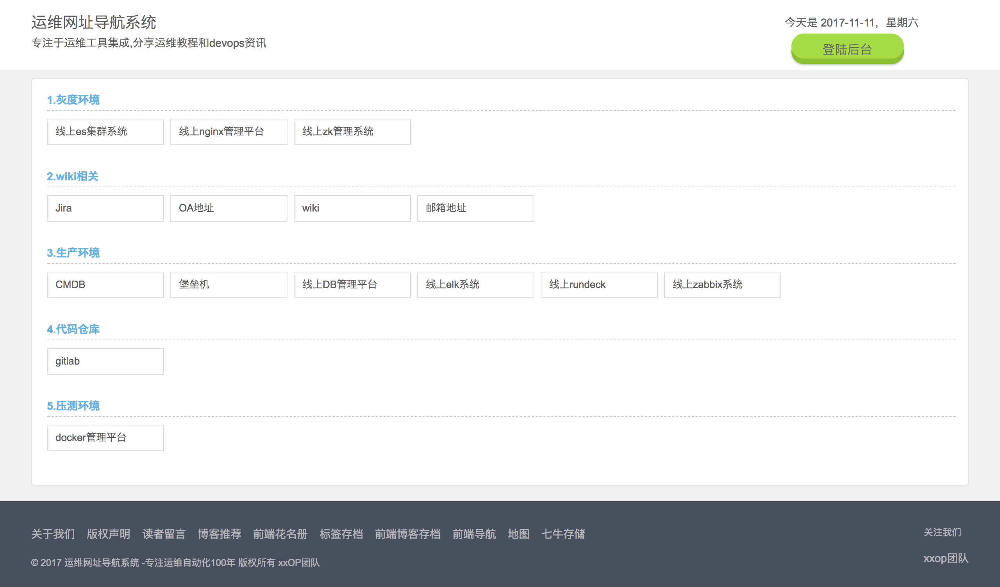
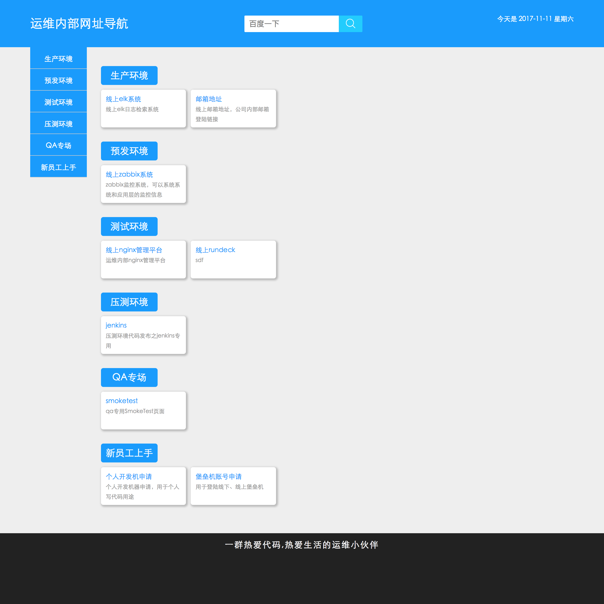

OP内部导航系统
============

[](https://www.python.org/)
[](https://www.djangoproject.com/)
[](https://newpanjing.github.io/simpleui/)


###  一、关于daohang

- 运维内部常用管理工具网址索引页
- 用以统计常用地址


### 二、具体使用

```cpp
0、git clone https://github.com/zhuima/daohang.git
1、cd daohang && pipenv install && pipenv shell
2、python manage.py runserver 0.0.0.0:8080
3、http://ip:8080
```

### 三、docker支持

> 也可以放到自己的私有仓库上去

    推荐使用harbor

> 本地使用

    生成的image名称要和docker-compose.yml中的文件对应起来

> 具体使用


```cpp
docker build -t daohang .
docker-compose up -d
```


### 四、TODO

- [x] vue重写前端展示页面和后台管理页面
- [ ] django的RESTful实现
- [ ] 分离脚本和views

### 五、说明

    为了方便大家预览效果，特定把db.sqlite3也上传到了代码仓库，
    后台登陆地址: http://ip:port/signin
    后台管理账号密码: 
    admin:zhuima


### 六、效果

> v1版本




> v2版本




### 七、致谢

[caibaojian站点](http://caibaojian.com/daohang)

[duanlijie站点](http://duanlijie.com/)

[simpleui](https://newpanjing.github.io/simpleui/QUICK.html)
